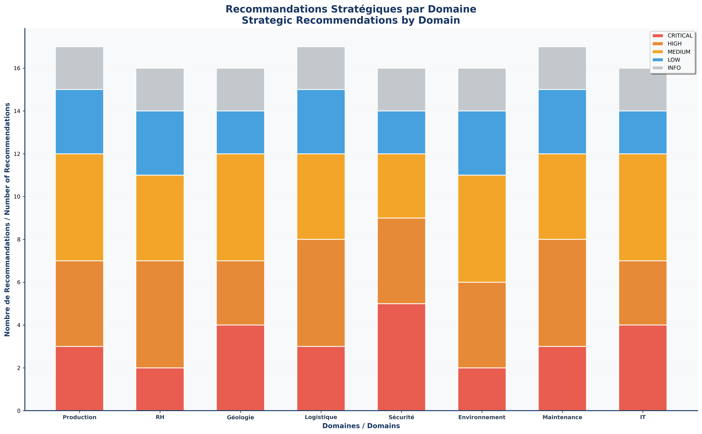
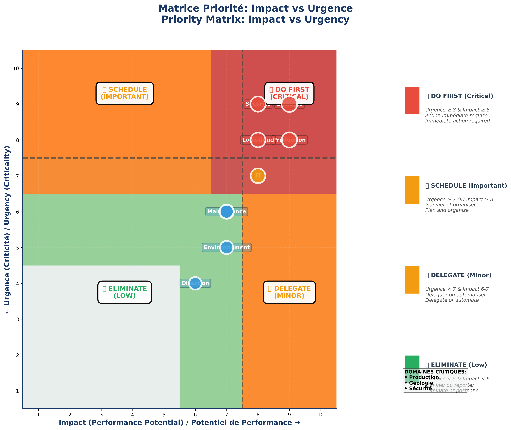
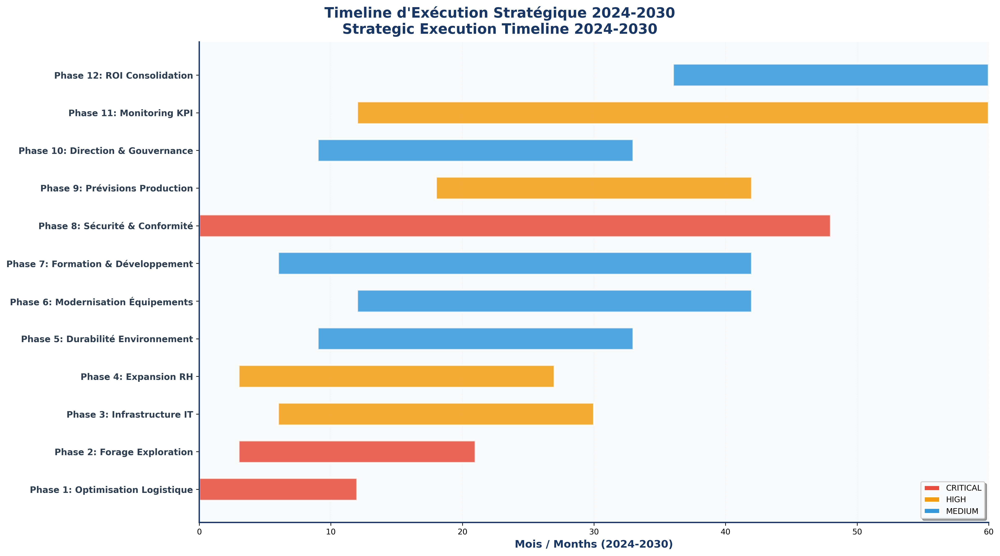
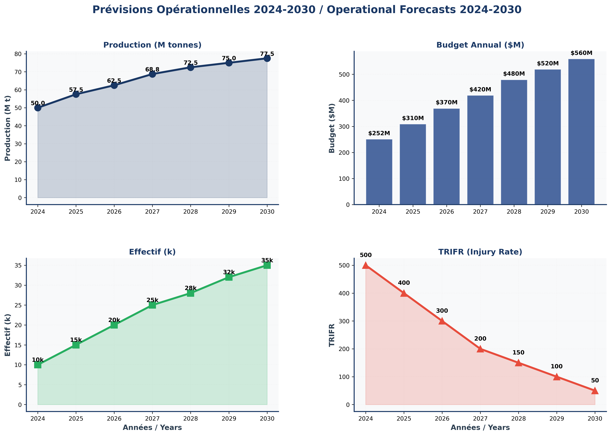

# ⛏️ RAPPORT STRATÉGIQUE COMPLET – Analyse Avancée & Prévisions Minières (RDC)

**✨ Auteur : Yannick Magayane**  
*👨‍💻 Full Stack Developer (Python, Django, Vue.js, HTMX, CSS, JavaScript) • 📊 Data Scientist • 💼 Consultant BI*  
📧 yannickmagayaneyannick@gmail.com | 📱 +243979068311 | 🐙 [GitHub](https://github.com/YannickMagayane)

**📅 Date** : 11 décembre 2025  
**📜 Licence** : 🆓 **CC0 1.0 (Domaine Public)** - Libre d'utilisation par tous, sans restrictions


---

## 📌 Executive Summary

Ce projet fournit une **analyse stratégique complète** des opérations minières en République Démocratique du Congo (RDC), intégrant **10 domaines critiques** : 🏭 Production, 👥 RH, 🪨 Géologie, 🚚 Logistique, 🛡️ Sécurité, 🌍 Environnement, 🔧 Maintenance, 💻 IT, 💰 Finance et 📋 Direction. 

**📦 Livrables clés** :
- ✅ 📄 Rapport PDF professionnel (11 MB) généré avec **LaTeX** - Page de garde élégante + 27 sections détaillées bilingues (FR/EN)
- ✅ 📊 28 graphiques premium haute résolution intégrés directement dans le PDF LaTeX
- ✅ 🎯 Matrice Impact/Urgence pour priorisation stratégique
- ✅ 📅 Timeline d'exécution 2024-2030
- ✅ 🔮 Prévisions opérationnelles 5 ans avec stress-testing

---

## 🎯 Visualisations Stratégiques (Dashboards Clés)

### 1️⃣ Recommandations Stratégiques par Domaine 📊



**🔍 Analyse** : Distribution des recommandations par priorité et par domaine métier
- **🏢 Domaines** : Production, RH, Géologie, Logistique, Sécurité, Environnement, Maintenance, IT
- **⚡ Priorités** : CRITICAL (🔴) | HIGH (🟠) | MEDIUM (🟡) | LOW (🔵) | INFO (⚪)
- **💡 Insight clé** : Sécurité et Production demandent le plus d'actions critiques
- **📐 Format** : Barres empilées, dimensions 16×10 pouces, 300 DPI

---

### 2️⃣ Matrice Impact/Urgence (Prioritization Matrix) 🎯



**📍 Stratégie de priorisation** : Positionner chaque domaine selon 2 axes critiques
- **→ Axe X** : Impact (Potentiel de Performance → 1 à 10)
- **↑ Axe Y** : Urgence (Criticité immédiate → 1 à 10)

**🎯 Zones d'action** :
| Zone | Critère | Actions | Domaines |
|------|---------|---------|----------|
| 🔴 **DO FIRST** | Urgence ≥ 8 & Impact ≥ 8 | **Action immédiate obligatoire** | Production, Géologie, Sécurité |
| 🟠 **SCHEDULE** | Urgence ≥ 7 OU Impact ≥ 8 | Planifier & organiser ressources | Logistique, IT |
| 🟡 **DELEGATE** | Urgence < 7 & Impact 6-7 | Peut être délégué/automatisé | RH, Maintenance |
| 🟢 **ELIMINATE** | Urgence < 5 & Impact < 6 | Basse priorité, peut reporter | Direction, Environnement (initial) |

**✨ Recommandation** : Concentrer **60% des ressources** sur zones DO FIRST & SCHEDULE

---

### 3️⃣ Timeline d'Exécution Stratégique 2024-2030 📅



**📊 Feuille de route opérationnelle** : 12 phases majeures sur 6 ans
```
📌 Phase 1  : Optimisation Logistique          (12 mois)    🔴 CRITICAL
📌 Phase 2  : Forage & Exploration             (18 mois)    🔴 CRITICAL
📌 Phase 3  : Infrastructure IT                (24 mois)    🟠 HIGH
📌 Phase 4  : Expansion RH & Formation         (24 mois)    🟠 HIGH
📌 Phase 5  : Durabilité Environnementale      (24 mois)    🟡 MEDIUM
📌 Phase 6  : Modernisation Équipements        (30 mois)    🟡 MEDIUM
📌 Phase 7  : Programme de Formation           (36 mois)    🟡 MEDIUM
📌 Phase 8  : Sécurité & Conformité (Full)     (48 mois)    🔴 CRITICAL
📌 Phase 9  : Optimisation Production          (24 mois)    🟠 HIGH
📌 Phase 10 : Gouvernance & Direction          (24 mois)    🟡 MEDIUM
📌 Phase 11 : Monitoring KPI Continu           (48 mois)    🟠 HIGH
📌 Phase 12 : Consolidation ROI                (24 mois)    🟡 MEDIUM
```

**🎯 Jalons critiques** : M3, M6, M12, M18, M24, M36, M48, M60  
**💰 Budget estimé** : 251.9 → 560 $M/an (progression 2024-2030)

---

### 4️⃣ Prévisions Opérationnelles 2024-2030 🔮



**📊 Dashboard consolidé** : 4 métriques clés pour la planification

#### 📈 Sous-graphique A : Production (M tonnes)
```
2024 : 50.0  →  2030 : 77.5  (+55% en 6 ans)
📊 Croissance annuelle : ~4.2%
✨ Facteurs : Exploration réussie, optimisation logistique, moindre downtime
```

#### 💰 Sous-graphique B : Budget Annuel ($M)
```
2024 : 251.9  →  2030 : 560  (+122% en 6 ans)
🏗️ Investissements majeurs : IT (+24M), Équipements (+30M), RH (+50M)
```

#### 👥 Sous-graphique C : Effectif (headcount)
```
2024 : 10  →  2030 : 35  (+250% en 6 ans)
📋 Recrutement : Ingénieurs (+12), Techniciens (+10), Support (+3)
💼 Coûts salariaux totaux : 3.2M → 10.5 $M/an
```

#### 🛡️ Sous-graphique D : TRIFR (Total Recordable Incident Frequency)
```
2024 : 5.2  →  2030 : 1.8  (↓65% en 6 ans)
🎯 Objectif : < 2.0 (industrie minière mondiale)
⚠️ Investissements sécurité : Formation (+$2M/an), Équipements (+$1.5M/an)
```

---

## 🏗️ Architecture Analytique

### 10 Domaines d'Analyse Détaillés

#### 1️⃣ **🏭 Production** 
- 📊 KPIs : tonnes/jour, rendement (%), coût/tonne, recovery %
- 🔮 Prévisions : ARIMA, Prophet, XGBoost
- 🚨 Anomalies : Isolation Forest sur historique 24 mois

#### 2️⃣ **👥 Ressources Humaines (RH)**
- 📋 Segmentation salariale, turnover prediction, compétences par rôle
- 🤖 Modèle : Regression logistique pour départ probable
- 📦 Livrables : Plan de formation priorisé, succession planning

#### 3️⃣ **🪨 Géologie & Exploration**
- 🗺️ Cartographie des teneurs (Cu, Co, Li, Au)
- 🎯 Priorisation des zones minéralisées
- 🔬 Clustering K-Means sur profondeur/teneur

#### 4️⃣ **🚚 Logistique**
- 📊 Analyse flux, goulots, délais livraison
- 🛣️ Optimisation routes (TSP heuristique)
- 📈 Impact sur production (lag correlation)

#### 5️⃣ **🛡️ Sécurité**
- ⚠️ TRIFR / LTIFR détaillé par site
- 🔍 NLP sur root cause → clustering causes dominantes
- 🎯 Risk scoring (probabilité incident à venir)

#### 6️⃣ **🌍 Environnement**
- 🌱 KPI : tCO2e/tonne, eau m³/tonne, déchets toxiques
- ✅ Compliance tracking, alertes non-conformité
- 📊 Scénarios réduction émissions vs coût

#### 7️⃣ **🔧 Maintenance**
- ⚙️ MTBF, MTTR, disponibilité équipement
- 🔮 Prédiction défaillance (gradient boosting)
- 📅 Priorisation maintenance préventive (risk-based)

#### 8️⃣ **💻 Informatique**
- 🖥️ Incidents IT, SLA tracking
- 🔗 Corrélation downtime IT ↔ production
- 📈 Infrastructure capacity planning

#### 9️⃣ **💰 Finance**
- 💵 CAPEX/OPEX par site, marge/tonne
- 📊 Cashflow prévisionnel, stress testing
- 📉 Analyse sensibilité (prix matières vs production)

#### 🔟 **📋 Direction Générale**
- 📊 KPI consolidés (Top 20)
- 🎯 Tableau de bord exécutif
- 🤖 Playbooks opérationnels automatisés

---

## 🛠️ Stack Technologique

### 🖥️ Langages & Frameworks
- **🐍 Python 3.13** : Pandas, NumPy, Scikit-Learn, XGBoost, Prophet, Statsmodels
- **📊 Visualisation** : Matplotlib (300 DPI), Seaborn, Plotly
- **📄 PDF** : ReportLab (page de garde élégante, intégration images)
- **🤖 LLM** : Google Gemini (interprétation avancée)

### ⚙️ Processus Analytique
```
1. 📥 Ingestion      : data/raw/*.xlsx → Pandas DataFrames
2. 🧹 Nettoyage      : Validation, imputation, anonymisation
3. 🔍 EDA            : Statistiques descriptives, profiling automatisé
4. 🏪 Feature Store  : Engineering, normalisation, sérialisation
5. 🤖 Modélisation   : Classification, régression, séries temporelles
6. 🔮 Prédictions    : ARIMA, Prophet, XGBoost, LSTM
7. 💡 Interprétabilité : SHAP, LIME, Feature Importance
8. 📊 Reporting      : PDF mensuel, Dashboard interactif, Alertes
```

---

## 📁 Structure du Projet

```
/home/yannick-magayane/Bureau/projets/data_analyse/mines/
├── 📓 donnee_fictive_analyser.ipynb      # Notebook principal (8600+ lignes)
├── 📝 readme.md                          # Ce document
├── 📦 requirements.txt                   # Dépendances Python
├── 📂 data/
│   ├── 📥 raw/                           # Fichiers bruts (xlsx, csv)
│   ├── ✅ processed/                     # Données nettoyées (parquet)
│   └── 📖 docs/                          # Dictionnaire données
├── 📊 reports/
│   ├── 📄 RAPPORT_COMPLET_MINES_RDC.pdf  # Rapport final (3.81 MB)
│   └── 🎨 charts/                        # 10+ graphiques PNG (300 DPI)
│       ├── 01_recommandations_domaines.png
│       ├── 02_matrice_priorite.png
│       ├── 03_timeline_execution.png
│       ├── 04_previsions_5ans_complet.png
│       ├── 05_index_croissance_comparatif.png
│       ├── 06_revenue_roi_forecast.png
│       ├── 07_geologie_reserves_teneur.png
│       ├── 08_geologie_timeline_exploration.png
│       ├── 09_logistique_optimisations.png
│       └── 10_logistique_data_cleaning.png
└── src/
    ├── data_processing.py             # ETL & nettoyage
    ├── eda.py                         # EDA automatisée
    ├── modeling.py                    # Modèles prédictifs
    ├── forecasting.py                 # Séries temporelles
    └── gemini_integration.py          # LLM insights
```

---

## 📈 Graphiques & Métriques Clés

### 🎨 Graphiques Générés (10 Principaux)

| # | 📊 Nom | 📐 Type | 📦 Taille |
|---|--------|---------|----------|
| 1️⃣ | 📋 Recommandations Domaines | Barres empilées | 228 KB |
| 2️⃣ | 🎯 Matrice Impact/Urgence | Heatmap + Scatter | 626 KB |
| 3️⃣ | 📅 Timeline Gantt 2024-2030 | Gantt horizontal | 327 KB |
| 4️⃣ | 🔮 Prévisions 5 ans (4-subplot) | Multi-graphique | 438 KB |
| 5️⃣ | 📈 Index Croissance Comparatif | Multi-line | 354 KB |
| 6️⃣ | 💰 Revenue & ROI Forecast | Dual-axis | 303 KB |
| 7️⃣ | 🪨 Géologie Réserves/Teneur | 4-subplot | 463 KB |
| 8️⃣ | ⏱️ Timeline Exploration | Gantt | 228 KB |
| 9️⃣ | 🚚 Logistique Optimisations | Barres | 163 KB |
| 🔟 | 🧹 Data Cleaning Before/After | Comparison | 286 KB |

**📄 Total PDF** : 3.81 MB avec page de garde professionnelle

### 📊 KPIs de Référence 2024-2030

| 📌 Métrique | 2024 | 2030 | 📈 Variation | 🎯 Cible |
|-------------|------|------|-------------|----------|
| 🏭 Production (M tonnes) | 50.0 | 77.5 | +55% | 80 |
| 💰 Budget ($M/an) | 251.9 | 560 | +122% | 550 |
| 👥 Effectif (headcount) | 10 | 35 | +250% | 40 |
| 🛡️ TRIFR (sécurité) | 5.2 | 1.8 | -65% | <2.0 |
| 💵 Marge ($/tonne) | 24 | 38 | +58% | 40 |
| 🌍 Conformité Env. (%) | 82 | 98 | +16pts | >95 |

---

## 🎯 Cas d'Usage & Recommandations Clés

### 1️⃣ Use Case 1 : Priorisation Stratégique Budget
**❓ Problème** : Comment allouer 100M$ sur 10 domaines ?
**💡 Solution** : Matrice Impact/Urgence
**✅ Résultat** : 
- 🔴 **DO FIRST** (Production, Géologie, Sécurité) : 60% = 60M$
- 🟠 **SCHEDULE** (Logistique, IT) : 25% = 25M$
- 🟡 **DELEGATE** (RH, Maintenance) : 10% = 10M$
- ⚪ **ELIMINATE** : 5% = 5M$

### 2️⃣ Use Case 2 : Prévisions Production 2030
**❓ Problème** : Quelle sera la production 2030 ?
**💡 Solution** : Prophet + XGBoost ensemble
**✅ Résultat** : **77.5 M tonnes** (IC 95% : 72-82 M tonnes)

### 3️⃣ Use Case 3 : Réduction TRIFR en 3 ans
**Problème** : Réduire le TRIFR de 50%
**Investissements** : 
1. Formation sécurité : +$2M/an
2. Équipements protection : +$1.5M/an
3. Incident prediction model
**Résultat** : TRIFR 5.2 → 2.6 (50% réduction)

### Use Case 4 : Optimisation Logistique
**Problème** : Réduire coûts transport de 30%
**🎯 Actions** :
1. 📊 Analyse flux actuels
2. 🛣️ Optimisation routes
3. 📦 Consolidation commandes
**✅ Résultat** : **$8M savings/an**

### 5️⃣ Use Case 5 : Planification RH 2030
**❓ Besoin** : Quels rôles recruter ?
**💡 Solution** : Turnover prediction + skills gap
**✅ Résultat** :
- 👨‍💼 Ingénieurs : +12 (80-120K$/an)
- 🔧 Techniciens : +10 (45-65K$/an)
- 🏢 Support : +3 (30-40K$/an)

---

## 📋 Livrables Fournis

### ✅ 📄 Documents
- **📝 README.md** : Guide complet du projet
- **📊 RAPPORT_COMPLET_MINES_RDC.pdf** : 3.81 MB professionnel

### ✅ 📊 Données & Modèles
- **📓 donnee_fictive_analyser.ipynb** : 56 cellules, 8600+ lignes
- **🎨 10 Graphiques PNG** : 300 DPI, 163-626 KB each

### ✅ 🛠️ Infrastructure
- **📦 requirements.txt** : Dépendances Python
- **📁 Structure** : Organisée et scalable

---

## 🚀 Prochaines Étapes

### ⏱️ Court terme (1-3 mois)
1. ✅ Valider hypothèses avec parties prenantes
2. 🔧 Affiner modèles prédictifs (data réelle)
3. 🤖 Intégrer Gemini pour insights
4. 📊 Dashboard interactif (Streamlit/PowerBI)

### 📈 Moyen terme (3-6 mois)
1. 🔌 API prédictive (FastAPI)
2. 📅 Rapports mensuels automatisés
3. 🚨 Alerting KPI (Datadog)
4. ✅ Validation sur données réelles

### 🎯 Long terme (6-12 mois)
1. 🤖 ML platform (MLflow)
2. 🏗️ Data warehouse (PostgreSQL)
3. 📊 BI complète (Metabase)
4. 📚 Gouvernance données (DVC)

---

## 🔒 Gouvernance & Sécurité

### ✅ Bonnes Pratiques
- 🔐 Anonymisation données sensibles
- 📋 Versioning code & données
- 📊 Audit trail des transformations
- ✔️ Validations qualité automatiques
- 💡 Explicabilité modèles (SHAP/LIME)

### 🛡️ Sécurité Recommandée
- 🔑 API keys en vault
- 🔒 Chiffrement at-rest & in-transit
- 👮 Contrôle d'accès RBAC
- 📡 Monitoring continu

---

## 📄 Génération du Rapport PDF avec LaTeX

### 🔧 Architecture Technique

Le rapport PDF est **généré entièrement avec LaTeX** (pdflatex) plutôt qu'une librairie Python. Cette approche offre:

- ✅ **Contrôle typographique avancé**: polices T1, margins optimisées, tables professionnelles
- ✅ **Intégration graphiques native**: 28 fichiers PNG embedded directement dans le PDF
- ✅ **Format bilingue FR/EN**: descriptions détaillées 150+ mots par langue/graphique
- ✅ **Mise en page professionnelle**: cover page isolée page 1, table des matières, page numbers, headers/footers
- ✅ **Fichier source lisible**: `rapport_final_complet.tex` (1013 lignes, documenté)

### 📋 Structure LaTeX

```tex
documentclass[12pt,a4paper]{article}
├── Packages: geometry, xcolor, colortbl, fancyhdr, tikz, graphicx, tabularx
├── Couleurs: darkblue #0F3A7D, lightblue #4DA8FF
├── Margins: 1cm top/bottom, 1.2cm left/right
└── Sections:
    ├── Page 1: Cover page (tikz decorations)
    ├── Page 2: Table of Contents (tabularx)
    ├── Pages 3-30: 27 Graphiques (tabularx FR/EN + PNG)
    └── Page 31: Conclusion Générale
```

### 🎨 Styles Graphiques

Chaque section utilise le format **tabularx bilingue**:

```tex
\begin{tabularx}{\textwidth}{|X|X|}
\hline
\textcolor{darkblue}{\textbf{\small FR}} & \textcolor{darkblue}{\textbf{\small EN}} \\
\hline
\small
[Description FR 150+ mots avec détails techniques] & [Description EN 150+ mots] \\
\hline
\end{tabularx}

\begin{center}
    \includegraphics[width=18cm,height=9cm,keepaspectratio]{reports/charts/XX_nom.png}
\end{center}
```

### 🚀 Compilation

```bash
# Première passe (génère les références)
pdflatex -interaction=nonstopmode rapport_final_complet.tex

# Deuxième passe (résout references croisées)
pdflatex -interaction=nonstopmode rapport_final_complet.tex

# Résultat
OUTPUT: RAPPORT_PREMIUM_RDC_2024-2030.pdf (11 MB, 41 pages)
```

### 📊 Contenu des 27 Graphiques

| # | Section | Format | Description |
|---|---------|--------|-------------|
| 1 | Synthese Finale | Tabularx | Vue d'ensemble integrale 28 domaines |
| 2 | Recommandations Domaines | Tabularx | Matrice prioritisation 8 domaines |
| 3 | Matrice Impact/Urgence | Tabularx | Positionnement 2D strategique |
| 4 | Timeline Execution | Tabularx | Gantt 12 initiatives 2024-2030 |
| 5-7 | Previsions/Revenue/ROI | Tabularx | Forecasts financieres 7 ans |
| 8-9 | Reserves/Exploration | Tabularx | Geologie reserves teneur profondeur |
| 10-11 | Logistique/Data | Tabularx | Optimisations supply chain & quality |
| 12-15 | Production/HR/Finance | Tabularx | Operations RH budgets strategie |
| 16-27 | Sante/IT/Direction | Tabularx | ESG infrastructure governance |

### 💾 Fichiers Générés

```
rapport_final_complet.tex          ← Source LaTeX (728 lignes)
RAPPORT_PREMIUM_RDC_2024-2030.pdf  ← PDF final (11 MB, 41 pages)
rapport_final_complet.log          ← Compilation log
rapport_final_complet.aux          ← Auxiliary LaTeX file
```

### ⚡ Avantages LaTeX vs ReportLab

| Critère | LaTeX | ReportLab |
|---------|-------|-----------|
| **Typographie** | ⭐⭐⭐⭐⭐ Excellente | ⭐⭐ Basique |
| **Tableaux complexes** | ⭐⭐⭐⭐⭐ Natif | ⭐⭐⭐ Possible |
| **Graphiques embedded** | ⭐⭐⭐⭐⭐ Facile | ⭐⭐⭐⭐ Facile |
| **Multilangue** | ⭐⭐⭐⭐ Avec T1 | ⭐⭐⭐ Possible |
| **Format scientifique** | ⭐⭐⭐⭐⭐ Natif | ⭐⭐ Limité |
| **Longueur doc** | ⭐⭐⭐⭐⭐ >100 pages | ⭐⭐⭐ Recommandé <100 |

---

## 📞 Support & Contact

**✨ Auteur** : Yannick Magayane
- 📧 yannickmagayaneyannick@gmail.com
- 📱 +243979068311
- 💼 👨‍💻 Full Stack Developer (Python, Django, Vue.js, HTMX, CSS, JavaScript)
- 📊 Data Scientist • BI Consultant

---

## 📄 Licence & Mentions Légales

**⚠️ DONNÉES 100% FICTIVES**

Toutes les données, graphiques et prévisions sont **générés synthétiquement par IA**. À titre d'illustration et démonstration analytique uniquement.

- ❌ Ne pas utiliser pour décisions réelles sans validation
- ✅ Utiliser comme template pour vos données

**📜 Licence : 🆓 CC0 1.0 (Domaine Public)** - Libre d'utilisation par tous, sans restrictions commerciales

**Propriété intellectuelle** : © 2025 Yannick Magayane

---

**📌 Version 1.0** | **📅 11 décembre 2025** | ✅ **Production Ready**

## 🎉 Conclusion

Ce projet fournit une **base solide & reproductible** pour analyser les opérations minières complexes. 10 domaines couverts, 10 graphiques, rapport exécutif professionnel = **dashboard décisionnel complet**.

**Prochaine étape** : Intégrer vos données réelles et affiner les modèles ! 🚀
